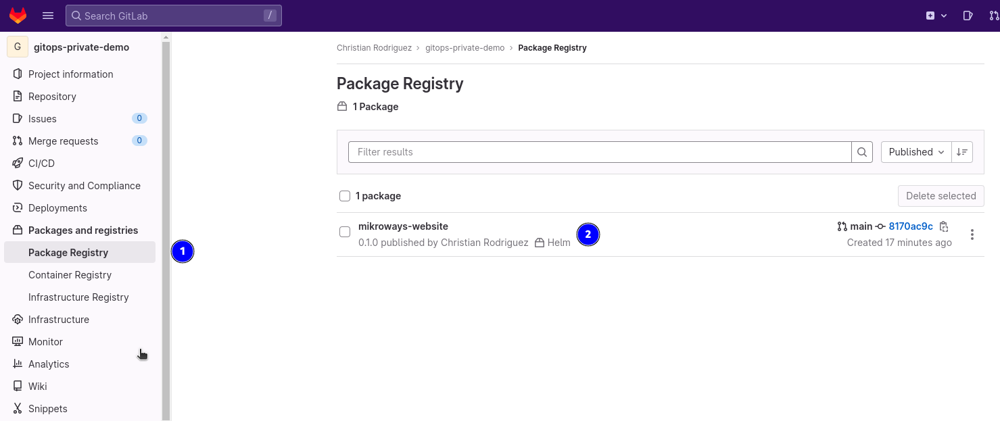
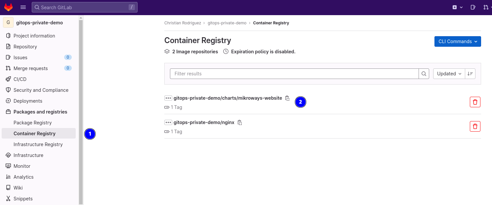
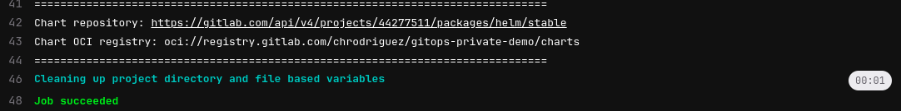
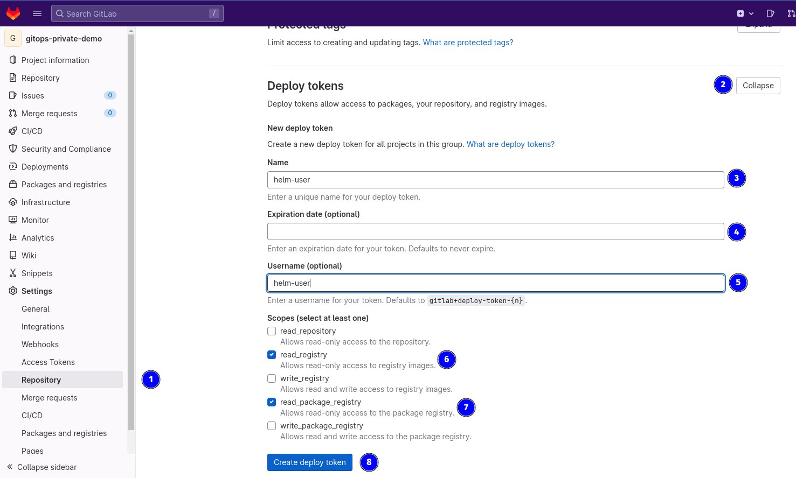

# Chart a almacenar de forma privada

Este directorio ya contiene un chart que se creó simplemente con el comando:

```bash
helm create mikroways-website
```

Y no hemos hecho nada más que eso. La idea del mismo, simplemente es
almacenarlo en un repositorio privado de charts o una [registry OCI](https://helm.sh/docs/topics/registries/).
Podemos usar diversos productos, para almacenar charts como es el caso de:

* [chartmuseum](https://chartmuseum.com/)
* [harbor](https://goharbor.io/)
* [artifacthub](https://github.com/artifacthub/hub)

Sin embargo, todos ellos requieren ser instalados y esto haría más complicado
nuestro ejemplo. Por ello, proponemos utilizar [Gitlab](https://gitlab.com/), que
admite ambos tipos de repositorios de charts.

Proveemos entonces un pipeline que crea el mismo chart y lo publica en dos
ubicaciones:

* Helm packages
* OCI container registry

Podemos ver entonces los charts en la interfaz de GitLab como muestran las
siguientes imágenes:



> En 1 seleccionamos ver los Packages y en 2 mostramos el chart que ya muestra
> ser de tipo Helm.



> En 1 seleccionamos ver la Registry OCI, donde veremos dos entradas que se
> corresponden con la imagen del nginx personalizadas mostrada en el ejemplo de
> registry privada, y ahora el chart empaquetado como un artefacto en una
> registry OCI que es un chart Helm (2).

Para saber cómo usar estos charts privados desde nuestra PC, tenemos que
entender que helm ofrece dos comandos diferentes para cada caso:

## helm repositories

Helm nos permite agregar repositorios y luego utilizar charts de un repositorio:

```bash
# Agregamos un repo
helm repo add NAME REPO_URL

# Usamos el repo
helm template NAME/chart-name
```

En nuestro caso, la URL del repo es un tanto compleja, como se explica en [la
documentación oficial de
Gitlab](https://docs.gitlab.com/ee/user/packages/helm_repository/). Para
simplificar la obtención del valor del REPO_URL, podemos ver la salida del
pipeline, que justamente imprime estos datos al finalizar como se muestra en la
siguiente captura:



> Imprime la URL del repositorio como de la registry OCI. Los datos aquí
> mostrados no serán los mismos que en tu caso, por lo que no debes copiarlos y
> utilizar tu salida en los ejemplos.

En base al resultado anterior, podemos entonces dar de alta el repositorio en
helm, que como se trata de un repositorio privado, necesitará usuario y
contraseña:

```bash

helm repo add \
  --username helm-user \
  --password helm-password \
  my-private-chart \
  https://gitlab.com/api/v4/projects/44277511/packages/helm/stable
```

El usuario y contraseña, deben configurarse como deploy tokens, como se explica
en la siguiente imagen:



> Accedemos a Settings, Repositories (1), luego expandimos Deploy tokens (2), y
> completamos los datos para un nuevo token: 3 define el nombre del token.
> Podemos definir un vencimiento (4), el username (5) y los permisos, que como
> muestran 6 y 7 están dando permisos al usuario a leer de la registry de
> contenedores y los paquetes. Finalmente creamos el token (8).

Podemos verificar si funciona el repositorio usando:

```bash
helm search repo my-private-repo
```

Obteniendo una salida como la siguiente:

```
NAME                                 CHART VERSION   APP VERSION   DESCRIPTION
my-private-repo/mikroways-website    0.1.0           1.16.0        A Helm chart for Kubernetes
```

## helm registries

Este caso es un poco diferente, porque los charts se descargan de una registry
de contenedores, una registry OCI. El manejo de charts en una registry a
diferencia de un repositrio, se gestiona con otro comando:

```bash
# Primero nos logueamos a una registry OCI
helm registry login -u helm-user -p

# Luego podemos hacer un pull
helm pull oci://URL/mychart --version x.y.z
```

Puede leerse la documentación disponible [en el sitio de helm](https://helm.sh/docs/topics/registries/).

Nuevamente, usando el mismo token creado para el repositorio de charts, y
observando la salida del pipeline, podemos usar los siguientes comandos para
probar si funciona helm con nuestra registry OCI:

```bash
echo helm-password | helm registry login -u helm-user --password-stdin registry.gitlab.com
helm pull oci://registry.gitlab.com/chrodriguez/gitops-private-demo/charts/mikroways-website
```

> El comando anterior dependerá de los datos propios de su repositorio, como
> además del token creado previamente.

Una vez que se pueda descargar el chart con pull, ya tendremos ambos escenarios
listos para continuar con nuestra prueba.

### Un problema con las registries OCI

Es **muy importante** saber que usar registries OCI con helm tiene ciertos
problemas, como sucede con docker login. Si nos logueamos, por ejemplo en
`registry.gitlab.com`, con un usuario y determinada password, luego si
hacemos nuevamente un login a la misma registry pero en diferente path, por
ejemplo `registry.gitlab.com/chrodriguez` habrán dos credenciales diferentes
para la misma registry, y no se hace una diferenciación por precisión de un
mejor match entre los strings `regustry.gitlab.com` y
`registry.gitlab.com/chrodriguez`. Esto sucede tanto con docker como con helm, y
podría traer problemas al usar registries OCI desde ArgoCD con credenciales
independientes para diferentes proyectos de Gitlab por ejemplo, donde se usa
una misma registry, y argo no maneja la idea de imagePullSecrets, generando
errores 401 o 403 por no usar la credencial adecuada.
